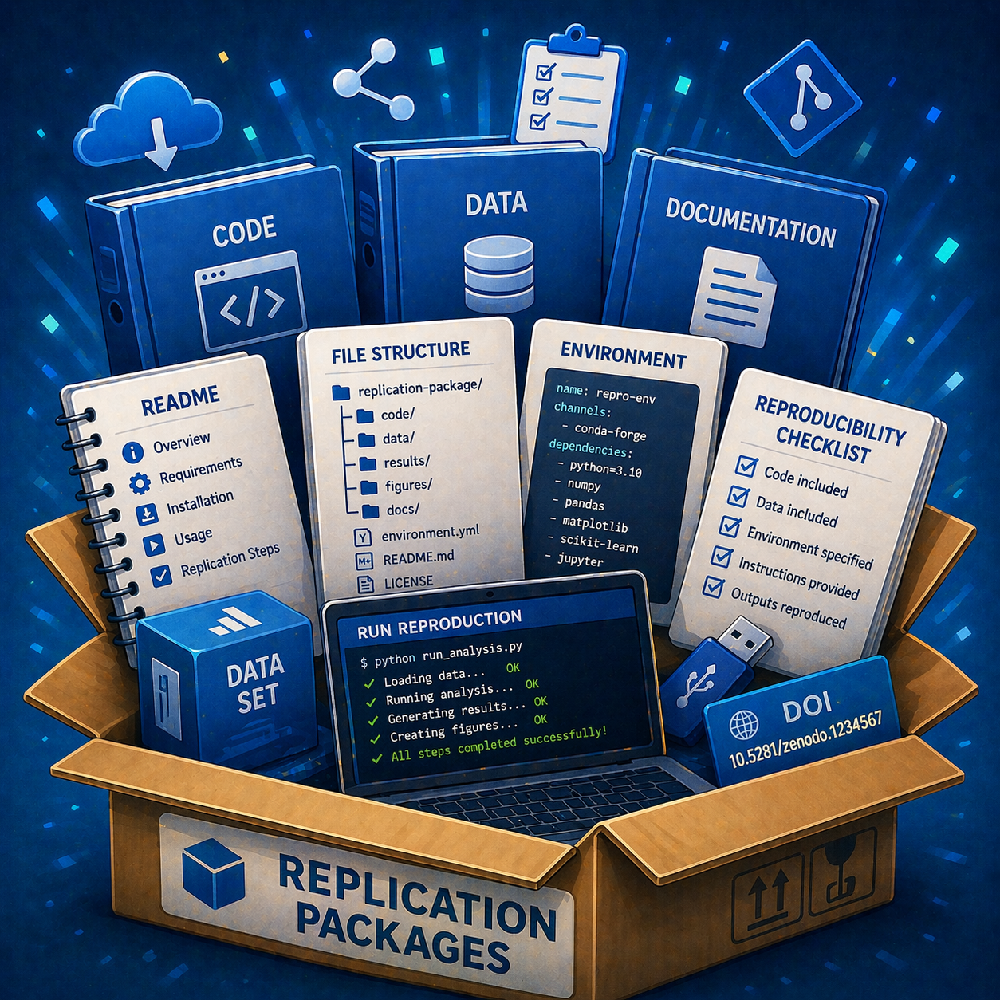
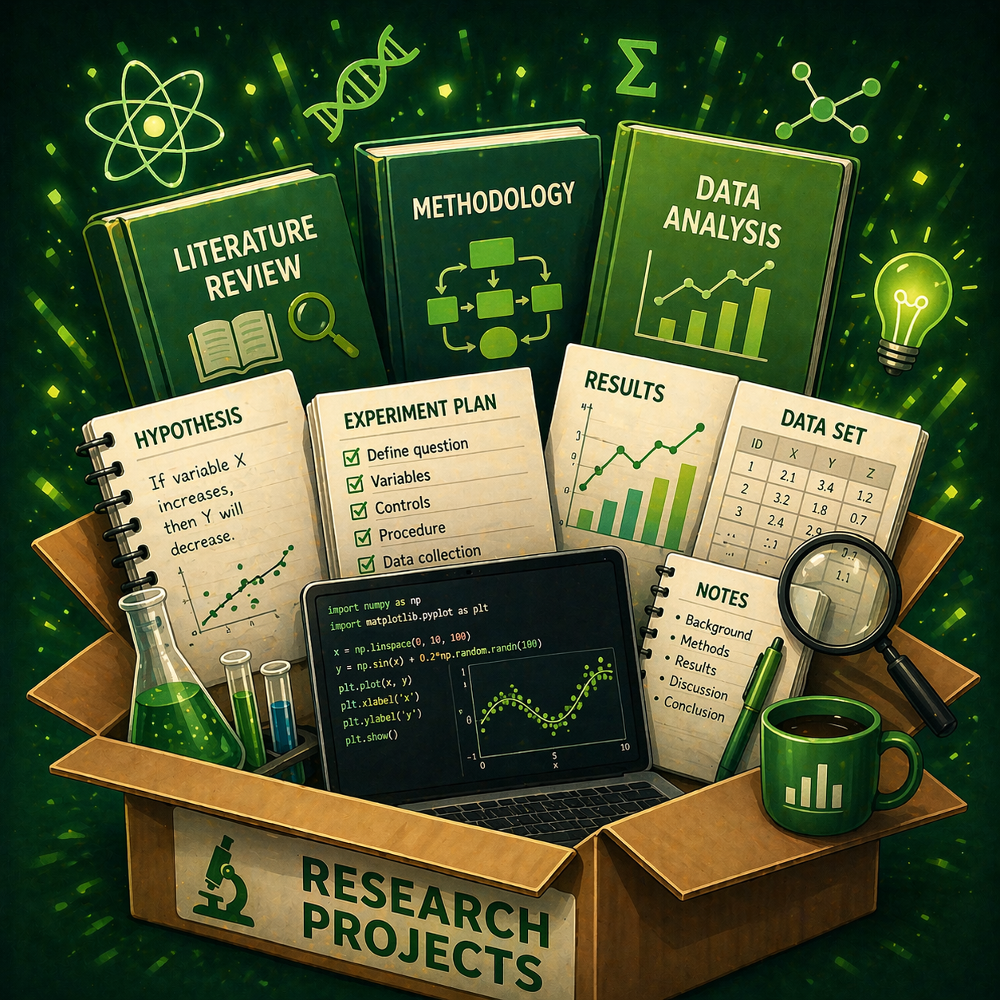
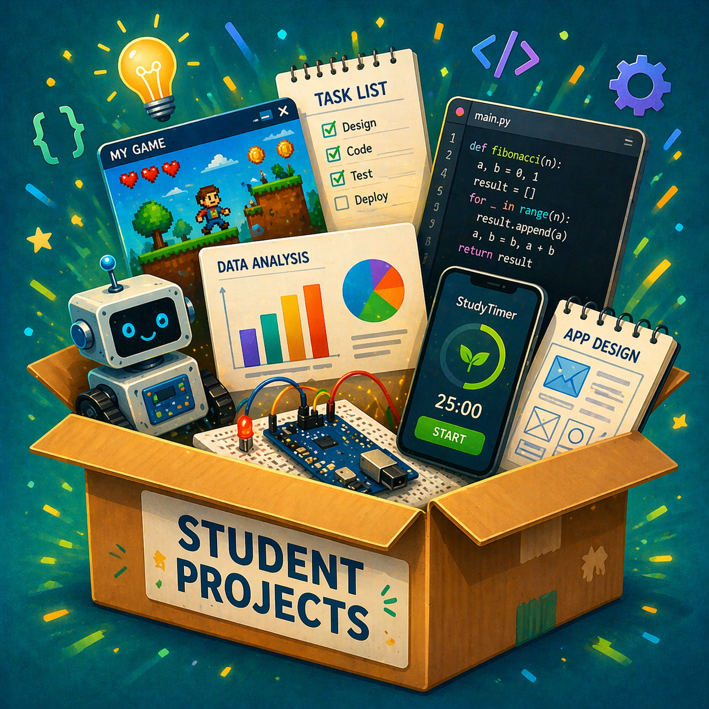
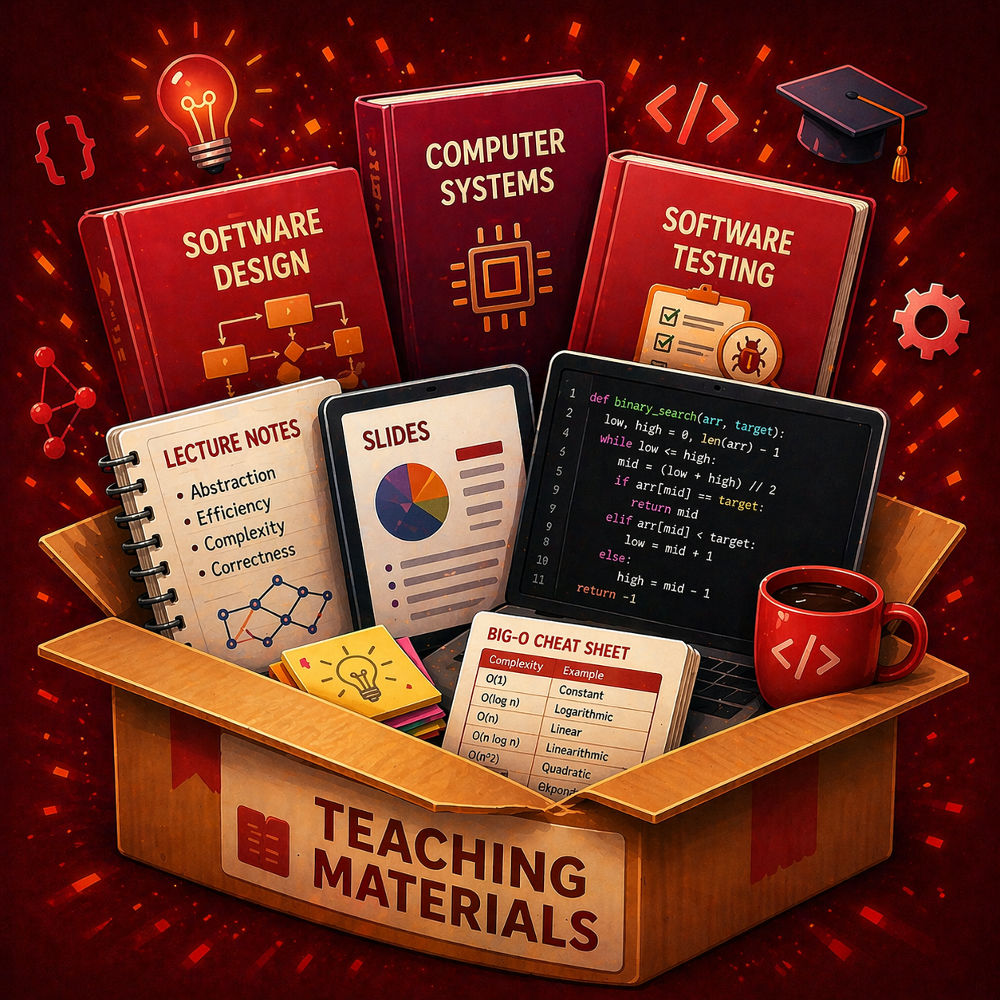

Welcome to the Sustainable Systems and Methods (SSM) Lab. We’re a research lab at the Department of Computing and Software (CAS) of the Faculty of Engineering at McMaster University, Canada.

### :telescope: Research focus
- AI and machine learning
- Model-driven engineering
- Digital twins
- Sustainable systems

### :page_with_curl: Key recent publications
#### AI/ML
- **A Reference Architecture of Reinforcement Learning Frameworks** by :bust_in_silhouette:[X. Liu](https://xiaoranliu.com/) and :bust_in_silhouette:[I. David](https://istvandavid.com/). ICSA. 2026. :page_facing_up: [[Preprint](https://arxiv.org/abs/2603.06413)]
- **Complex Model Transformations by Reinforcement Learning with Uncertain Human Guidance** by K. Dagenais and :bust_in_silhouette:[I. David](https://istvandavid.com/). 2025. :page_facing_up: [10.1109/MODELS67397.2025.00025](https://doi.org/10.1109/MODELS67397.2025.00025) [[Preprint](https://arxiv.org/abs/2506.20883)] :fire: $${\color{red}ACM \space SIGSOFT \space Distinguished \space Paper \space Award}$$ :fire: 
- **AI Simulation by Digital Twins: Systematic Survey, Reference Framework, and Mapping to a Standardized Architecture** by :bust_in_silhouette:[X. Liu](https://xiaoranliu.com/) and :bust_in_silhouette:[I. David](https://istvandavid.com/). SoSyM. 2025. :page_facing_up:[10.1007/s10270-025-01306-0](https://doi.org/10.1007/s10270-025-01306-0) [[Preprint](https://arxiv.org/abs/2506.06580)]
- **On the Utility of Domain Modeling Assistance with Large Language Models** by M. Ben Chaaben, L. Burgueño, :bust_in_silhouette:[I. David](https://istvandavid.com/), and H. Sahraoui. TOSEM. 2025. :page_facing_up: [10.1145/3744920](https://doi.org/10.1145/3744920) [[Preprint](https://arxiv.org/abs/2410.12577)]
- **Screening Articles for Systematic Reviews with ChatGPT** by E. Syriani, :bust_in_silhouette:[I. David](https://istvandavid.com/), G. Kumar. COLA. 2024. :page_facing_up:[10.1016/j.cola.2024.101287](https://doi.org/10.1016/j.cola.2024.101287) [[Preprint](https://istvandavid.com/files/ChatGPT-Screening-SR-COLA.pdf)]

#### Digital twins and model-driven engineering
- **Introduction to Digital Twins for the Smart Grid** by :bust_in_silhouette:[X. Liu](https://xiaoranliu.com/) and :bust_in_silhouette:[I. David](https://istvandavid.com/). Digital twin technology and smart grid. Chapter 1. Elsevier. 2026. :page_facing_up: [[Preprint](https://arxiv.org/abs/2602.14256)]
- **Artificial Intelligence for Modeling & Simulation in Digital Twins** by P. Zech and :bust_in_silhouette:[I. David](https://istvandavid.com/). Artificial Intelligence in Modeling and Simulation. Springer. 2026. :page_facing_up: [[Preprint](https://arxiv.org/abs/2602.19390)]
- **Engineering Automotive Digital Twins on Standardized Architectures: A Case Study** by S. Ramdhan, W. Trandinh, :bust_in_silhouette:[I. David](https://istvandavid.com/), V. Pantelic, and M. Lawford. MODELS/EDTConf. 2025. :page_facing_up: [10.1109/MODELS-C68889.2025.00034](https://doi.org/10.1109/MODELS-C68889.2025.00034) [[Preprint](https://arxiv.org/abs/2508.18662)]
- **Interoperability of Digital Twins: Challenges, Success Factors, and Future Research Directions** by :bust_in_silhouette:[I. David](https://istvandavid.com/), G. Shao, C. Gomes, D. Tilbury, and B. Zarkout. ISoLA. 2024. :page_facing_up:[10.1007/978-3-031-75390-9_3](https://doi.org/10.1007/978-3-031-75390-9_3) [[Preprint](https://istvandavid.com/files/DT-interoperability-ISoLA2024.pdf)].
- **Automated Inference of Simulators in Digital Twins** by :bust_in_silhouette:[I. David](https://istvandavid.com/) and E. Syriani. Handbook of Digital Twins. Chapter 8. 2024. :page_facing_up:[10.1201/9781003425724-11](https://doi.org/10.1201/9781003425724-11) [[Preprint](https://istvandavid.com/files/rl4sim-bookchapter-2023.pdf)]

#### Sustainability
- **Trust the AI, Doubt Yourself: The Effect of Urgency on Self-Confidence in Human-AI Interaction** by :bust_in_silhouette:[B. Shajari](https://baranshajari.github.io/), :bust_in_silhouette:[X. Liu](https://xiaoranliu.com/), K. Dagenais, :bust_in_silhouette:[I. David](https://istvandavid.com/). 2026. :page_facing_up: [[Preprint](https://arxiv.org/abs/2604.07535)]
- **Bridging the Silos of Digitalization and Sustainability by Twin Transition: A Multivocal Literature Review** by :bust_in_silhouette:[B. Shajari](https://baranshajari.github.io/), :bust_in_silhouette:[I. David](https://istvandavid.com/). ICT4S. 2025. :page_facing_up: [10.1109/ICT4S68164.2025.00012](https://doi.org/10.1109/ICT4S68164.2025.00012) [[Preprint](https://istvandavid.com/files/twin-transition-ict4s-2025.pdf)]
- **Participatory and Collaborative Modeling of Sustainable Systems: A Systematic Review** by R. Manellanga, :bust_in_silhouette:[I. David](https://istvandavid.com/). MODELS-C. 2024. :page_facing_up:[10.1145/3652620.3688557](https://doi.org/10.1145/3652620.3688557) [[Preprint](https://istvandavid.com/files/participatory-collaborative-modeling-sustainability-review-2024.pdf)]
- **Circular Systems Engineering** by :bust_in_silhouette:[I. David](https://istvandavid.com/), D. Bork, and G. Kappel. SoSyM. 2024. :page_facing_up:[10.1007/s10270-024-01154-4](https://doi.org/10.1007/s10270-024-01154-4) [[Preprint](https://arxiv.org/abs/2306.17808)]
- **The Role of Modeling in the Analysis and Design of Sustainable Systems: A Panel Report** by D. Bork, :bust_in_silhouette:[I. David](https://istvandavid.com/), S. Espana, G. Guizzardi, H. Proper, I. Reinhartz-Berger. CAIS. 2024. :page_facing_up:[10.17705/1CAIS.05434](https://aisel.aisnet.org/cais/vol54/iss1/41/) [[Preprint](https://istvandavid.com/files/The-Role-of-Modeling-in-the-Design-and-Analysis-of-Sustainable-Systems.pdf)]

### Repositories

